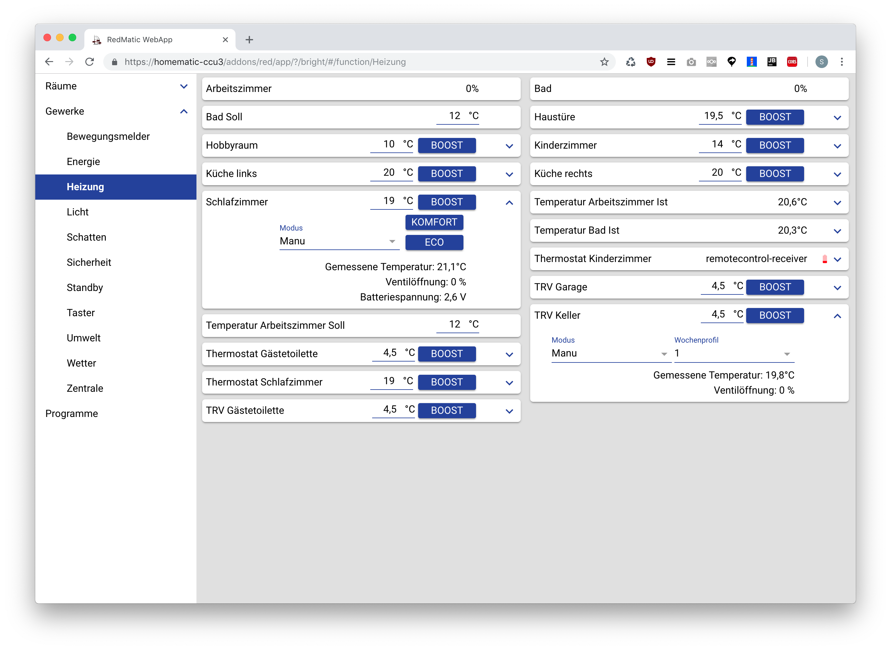
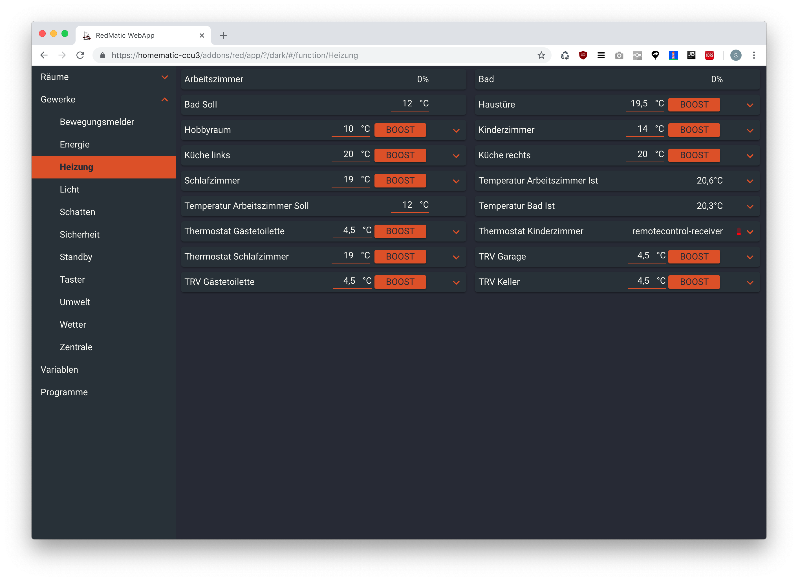
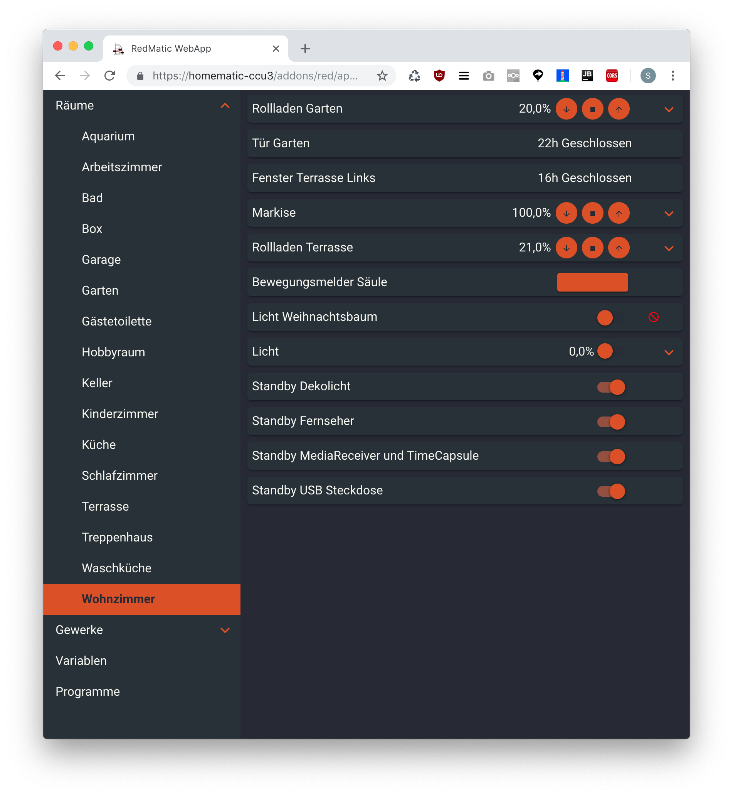
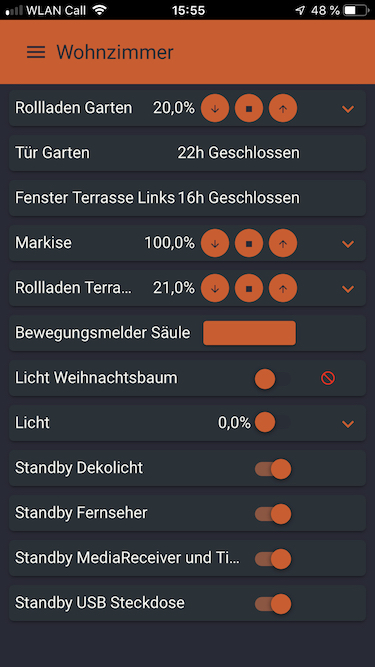
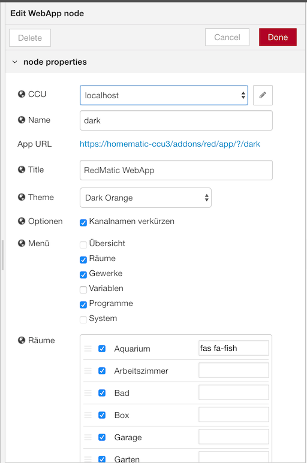

# RedMatic WebApp

[](http://badge.fury.io/js/redmatic-webapp)


> RedMatic based Homematic UI

Diese auf RedMatic aufsetzende WebApp ist vergleichbar mit _WebMatic_ oder _Yahui_ und stellt ohne die Notwendigkeit
etwas konfigurieren zu müssen eine Bedienoberfläche für den Browser und Mobilgeräte bereit.

__Work in Progress__ Dieses Projekt befindet sich noch in einem frühen Entwicklungsstadium und ist als Alpha/Beta
Software zu betrachten.

## Installation

``` 
export PATH=/usr/local/addons/redmatic/bin:$PATH
cd /usr/local/addons/redmatic/var
npm install --save --no-package-lock --global-style --save-prefix="~" --production redmatic-webapp
```


## Screenshots










    


    


## License

© 2018 Sebastian Raff and RedMatic-WebApp Contributors, licensed under [Apache License 2.0](LICENSE)
